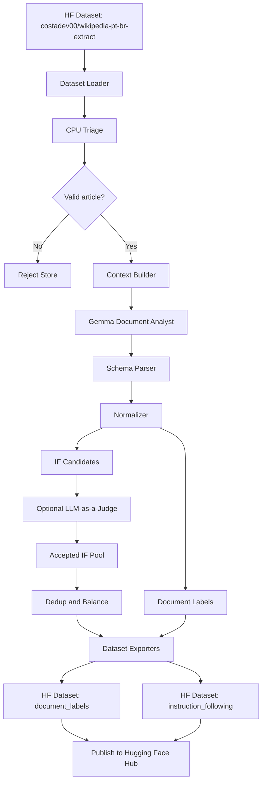

# wiki-if-builder

MVP em Python para rotular artigos da Wikipedia pt-BR e gerar um dataset sintético de Instruction Following/SFT a partir de `costadev00/wikipedia-pt-br-extract`.

O foco é uma pipeline local, auditável e segura para máquina com discos dedicados: triagem determinística em CPU, uma chamada principal ao LLM por artigo válido, judge opcional em chamada separada, normalização Pydantic, export local e publicação controlada no Hugging Face Hub.

## Arquitetura



## Instalação

```bash
python3 -m pip install -e .
```

Python 3.11+ é obrigatório. As dependências principais são `datasets`, `pydantic`, `openai`, `typer`, `rich`, `orjson`, `python-dotenv`, `tenacity`, `pytest`, `huggingface_hub`, `pyarrow` e `psutil`.

## Configuração

Copie `.env.example` para `.env` e ajuste os valores:

```bash
cp .env.example .env
```

Valores importantes:

```bash
OPENAI_BASE_URL=http://localhost:8000/v1
OPENAI_BASE_URLS=http://localhost:8000/v1,http://localhost:8001/v1,http://localhost:8002/v1,http://localhost:8003/v1
OPENAI_API_KEY=local-token
MODEL_NAME=gemma-local
JUDGE_MODEL_NAME=gemma-local
HF_TOKEN=
```

## Política de armazenamento

Por padrão, a aplicação usa:

```bash
WORK_DIR=/mnt/disco1/wiki-if-builder
CACHE_DIR=/mnt/disco1/wiki-if-builder/cache
OUTPUT_DIR=/mnt/disco1/wiki-if-builder/outputs
HF_HOME=/mnt/disco1/wiki-if-builder/cache/huggingface
HF_DATASETS_CACHE=/mnt/disco1/wiki-if-builder/cache/huggingface/datasets
TRANSFORMERS_CACHE=/mnt/disco1/wiki-if-builder/cache/huggingface/transformers
MODEL_CACHE_DIR=/mnt/disco1/wiki-if-builder/models
TMPDIR=/mnt/disco2/wiki-if-builder/tmp
```

O `doctor` cria diretórios ausentes, alerta quando paths estão no filesystem raiz, alerta se `/` tiver menos de 100 GB livres e falha se `OUTPUT_DIR` tiver menos de 50 GB livres ou `CACHE_DIR` menos de 100 GB livres. Os limites podem ser alterados por CLI.

## Servidor vLLM OpenAI-Compatible

Endpoint único:

```bash
CUDA_VISIBLE_DEVICES=0,1,2,3 vllm serve <MODEL_NAME> \
  --tensor-parallel-size 4 \
  --host 0.0.0.0 \
  --port 8000

export OPENAI_BASE_URL=http://localhost:8000/v1
export OPENAI_API_KEY=local-token
```

Quatro endpoints locais, uma réplica por GPU:

```bash
CUDA_VISIBLE_DEVICES=0 vllm serve <MODEL_NAME> --host 0.0.0.0 --port 8000
CUDA_VISIBLE_DEVICES=1 vllm serve <MODEL_NAME> --host 0.0.0.0 --port 8001
CUDA_VISIBLE_DEVICES=2 vllm serve <MODEL_NAME> --host 0.0.0.0 --port 8002
CUDA_VISIBLE_DEVICES=3 vllm serve <MODEL_NAME> --host 0.0.0.0 --port 8003

export OPENAI_BASE_URLS=http://localhost:8000/v1,http://localhost:8001/v1,http://localhost:8002/v1,http://localhost:8003/v1
export OPENAI_API_KEY=local-token
```

Quando `OPENAI_BASE_URLS` está definido, o cliente distribui chamadas por round robin simples.

## Comandos

Verificar ambiente:

```bash
python3 -m wiki_if_builder doctor
```

Dry-run sem LLM:

```bash
python3 -m wiki_if_builder run \
  --max-articles 10 \
  --dry-run true \
  --output-dir /mnt/disco1/wiki-if-builder/outputs \
  --cache-dir /mnt/disco1/wiki-if-builder/cache \
  --tmp-dir /mnt/disco2/wiki-if-builder/tmp
```

Rodar com modelo local:

```bash
python3 -m wiki_if_builder run \
  --max-articles 100 \
  --output-dir /mnt/disco1/wiki-if-builder/outputs \
  --cache-dir /mnt/disco1/wiki-if-builder/cache \
  --tmp-dir /mnt/disco2/wiki-if-builder/tmp \
  --enable-judge false \
  --max-input-chars 120000 \
  --candidates-per-article 3 \
  --max-concurrent-llm-calls 4 \
  --num-workers 4
```

Somente triagem:

```bash
python3 -m wiki_if_builder triage --max-articles 1000 --output-dir /mnt/disco1/wiki-if-builder/outputs
```

Reexportar intermediários:

```bash
python3 -m wiki_if_builder export --output-dir /mnt/disco1/wiki-if-builder/outputs --include-review false
```

Inspecionar amostras:

```bash
python3 -m wiki_if_builder inspect --output-dir /mnt/disco1/wiki-if-builder/outputs --limit 10
```

## Artefatos

Intermediários:

```text
OUTPUT_DIR/intermediate/triage_report.jsonl
OUTPUT_DIR/intermediate/analyst_outputs.jsonl
OUTPUT_DIR/intermediate/normalized_outputs.jsonl
OUTPUT_DIR/intermediate/judge_results.jsonl
OUTPUT_DIR/intermediate/rejected_candidates.jsonl
OUTPUT_DIR/intermediate/raw_errors.jsonl
```

Datasets finais:

```text
OUTPUT_DIR/document_labels/data.jsonl
OUTPUT_DIR/document_labels/README.md
OUTPUT_DIR/document_labels/dataset_info.json

OUTPUT_DIR/instruction_following/data.jsonl
OUTPUT_DIR/instruction_following/README.md
OUTPUT_DIR/instruction_following/dataset_info.json
```

`document_labels` tem um registro por artigo. `instruction_following` tem um registro por exemplo `instruction/input/output` e inclui também `messages`, sem template de chat específico, tokens especiais, chain of thought ou conteúdo de judge no `output`.

## Publicação no Hugging Face Hub

Publicação é privada por padrão e exige `HF_TOKEN`.

```bash
python3 -m wiki_if_builder publish-labels \
  --repo-id costadev00/wikipedia-pt-br-article-labels-gemma \
  --local-dir /mnt/disco1/wiki-if-builder/outputs/document_labels \
  --private true

python3 -m wiki_if_builder publish-if \
  --repo-id costadev00/wikipedia-pt-br-instructions-gemma \
  --local-dir /mnt/disco1/wiki-if-builder/outputs/instruction_following \
  --private true

python3 -m wiki_if_builder publish-all \
  --labels-repo-id costadev00/wikipedia-pt-br-article-labels-gemma \
  --if-repo-id costadev00/wikipedia-pt-br-instructions-gemma \
  --output-dir /mnt/disco1/wiki-if-builder/outputs \
  --private true
```

Antes de tornar público, revise amostras com `inspect`, confira `rejected_candidates.jsonl`, leia linhas aleatórias dos dois `data.jsonl` e valide se a licença e a proveniência aparecem em todas as linhas.

## Execução recomendada na máquina c4ais10

1. Use `/mnt/disco1` para cache, modelos e outputs.
2. Use `/mnt/disco2` para temporários grandes.
3. Evite escrever arquivos grandes no disco raiz.
4. Use `streaming=True` no Hugging Face Dataset.
5. Processe artigo por artigo.
6. Comece com `max_input_chars=120000`.
7. Comece com `candidates_per_article=3`.
8. Comece com `enable_judge=false` para validar throughput.
9. Depois ative `enable_judge=true` em uma amostra.
10. Para throughput, prefira quatro réplicas independentes, uma por GPU.
11. Use `OPENAI_BASE_URLS` com quatro endpoints.
12. Use `max_concurrent_llm_calls=4` quando houver quatro endpoints.
13. Use `max_concurrent_llm_calls=1` se houver apenas um endpoint com tensor parallel.

Preparação:

```bash
mkdir -p /mnt/disco1/wiki-if-builder/cache
mkdir -p /mnt/disco1/wiki-if-builder/outputs
mkdir -p /mnt/disco1/wiki-if-builder/models
mkdir -p /mnt/disco2/wiki-if-builder/tmp

export WORK_DIR=/mnt/disco1/wiki-if-builder
export CACHE_DIR=/mnt/disco1/wiki-if-builder/cache
export OUTPUT_DIR=/mnt/disco1/wiki-if-builder/outputs
export HF_HOME=/mnt/disco1/wiki-if-builder/cache/huggingface
export HF_DATASETS_CACHE=/mnt/disco1/wiki-if-builder/cache/huggingface/datasets
export TRANSFORMERS_CACHE=/mnt/disco1/wiki-if-builder/cache/huggingface/transformers
export TMPDIR=/mnt/disco2/wiki-if-builder/tmp
```

Opção recomendada para throughput:

```bash
CUDA_VISIBLE_DEVICES=0 vllm serve <MODEL_NAME> --host 0.0.0.0 --port 8000
CUDA_VISIBLE_DEVICES=1 vllm serve <MODEL_NAME> --host 0.0.0.0 --port 8001
CUDA_VISIBLE_DEVICES=2 vllm serve <MODEL_NAME> --host 0.0.0.0 --port 8002
CUDA_VISIBLE_DEVICES=3 vllm serve <MODEL_NAME> --host 0.0.0.0 --port 8003

export OPENAI_BASE_URLS=http://localhost:8000/v1,http://localhost:8001/v1,http://localhost:8002/v1,http://localhost:8003/v1
export OPENAI_API_KEY=local-token

python3 -m wiki_if_builder doctor

python3 -m wiki_if_builder run \
  --max-articles 100 \
  --output-dir /mnt/disco1/wiki-if-builder/outputs \
  --cache-dir /mnt/disco1/wiki-if-builder/cache \
  --tmp-dir /mnt/disco2/wiki-if-builder/tmp \
  --enable-judge false \
  --max-input-chars 120000 \
  --candidates-per-article 3 \
  --max-concurrent-llm-calls 4 \
  --num-workers 4
```

Opção alternativa para contexto maior:

```bash
CUDA_VISIBLE_DEVICES=0,1,2,3 vllm serve <MODEL_NAME> \
  --tensor-parallel-size 4 \
  --host 0.0.0.0 \
  --port 8000

export OPENAI_BASE_URL=http://localhost:8000/v1
export OPENAI_API_KEY=local-token

python3 -m wiki_if_builder run \
  --max-articles 100 \
  --output-dir /mnt/disco1/wiki-if-builder/outputs \
  --cache-dir /mnt/disco1/wiki-if-builder/cache \
  --tmp-dir /mnt/disco2/wiki-if-builder/tmp \
  --enable-judge false \
  --max-input-chars 120000 \
  --candidates-per-article 3 \
  --max-concurrent-llm-calls 1 \
  --num-workers 1
```

Recomendação de produção inicial: quatro réplicas independentes, `OPENAI_BASE_URLS`, `max_concurrent_llm_calls=4`, `num_workers=4`, `max_input_chars=120000`, `enable_judge=false` nos primeiros testes e depois `enable_judge=true --max-articles 1000` para validar uma amostra.

## Próximos passos para produção

Adicionar tokenização real para orçamento de contexto, balanceamento por categoria/task type, splits `train/validation/test`, deduplicação semântica, métricas agregadas de judge, dashboards de auditoria e integração com jobs agendados. O MVP não implementa treinamento SFT nem UI web.

